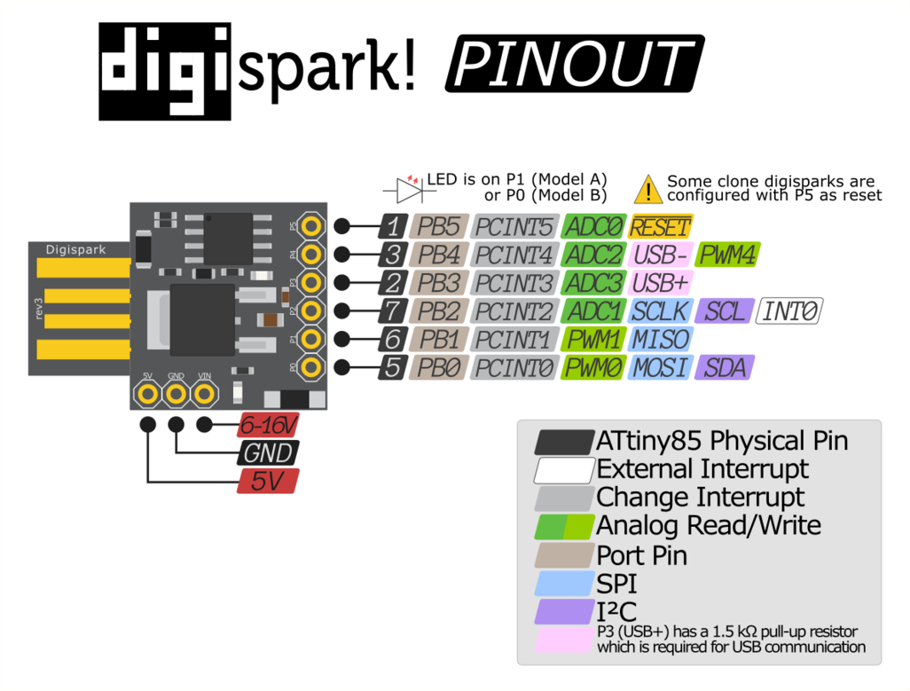
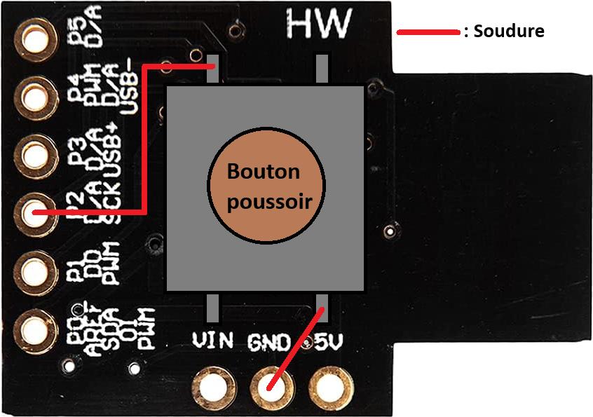
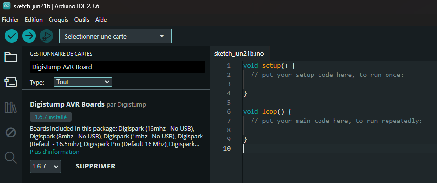
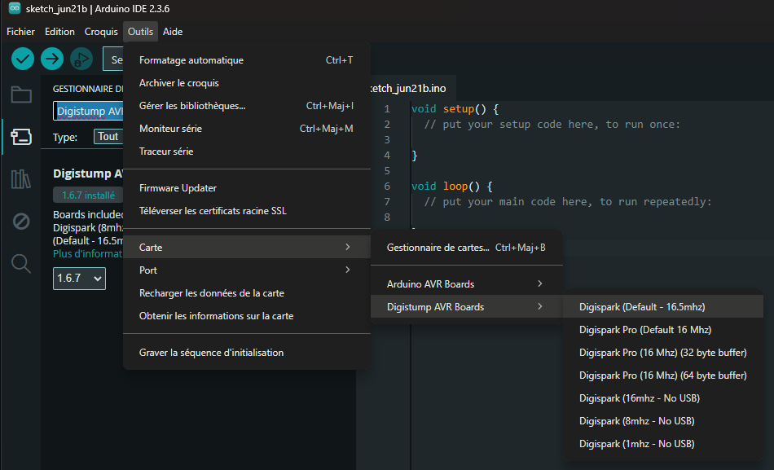
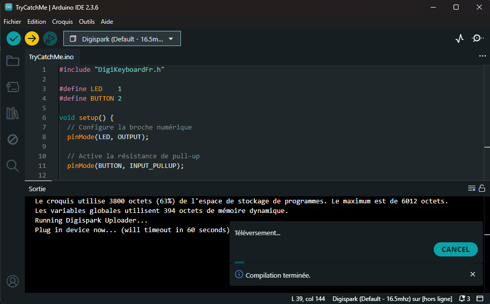

# ATtiny85 Rubber Ducky – Alternative Économique

<p align="center">
  
</p>

## Introduction

Les clés **Rubber Ducky** sont des outils puissants utilisés pour l'automatisation de frappes clavier à des fins de test de sécurité. Cependant, leur prix peut être dissuasif, avoisinant souvent les **100 €**.

Ce projet propose une **alternative beaucoup plus économique** en utilisant un microcontrôleur **ATtiny85**, disponible pour moins de **10 €**, tout en conservant l'essentiel des fonctionnalités.

Les modules **Digispark ATtiny85** sont des microcontrôleurs compacts compatibles avec l'IDE Arduino. Ils permettent de simuler un clavier USB et de lancer automatiquement des scripts clavier dès qu'ils sont branchés à un ordinateur.

## Sommaire

- [Matériel requis](#matériel-requis)
- [Ajout d’un bouton poussoir](#ajout-dun-bouton-poussoir)
- [Schéma de soudure](#schéma-de-soudure)
- [Installation & Programmation](#installation--programmation)
- [Conseils & Astuces](#conseils--astuces)
- [Liens utiles](#liens-utiles)

## Matériel requis

| Élément              | Description                                                                                  | Lien                                    |
|----------------------|----------------------------------------------------------------------------------------------|-----------------------------------------|
| **ATtiny85 Digispark** | Microcontrôleur USB compatible Arduino                                                        | [Acheter sur Amazon](https://www.amazon.fr/dp/B01N7SGC1I?ref=ppx_yo2ov_dt_b_fed_asin_title) |
| **Bouton poussoir**    | Bouton tactile 4 broches (recommandé : Diptronics DTSP-21N-V)                                | [Voir sur Mouser](https://www.mouser.lu/ProductDetail/Diptronics/DTSP-21N-V?qs=MLItCLRbWsx9tZkqq0CCiQ%3D%3D) |
| **Fer à souder + étain** | Pour réaliser les connexions                                                               | [Acheter sur Amazon](https://www.amazon.fr/dp/B0CNXJJCXY?ref=ppx_yo2ov_dt_b_fed_asin_title) |
| **Super glue**         | Pour fixer solidement le bouton à la carte                                                   | –                                       |

## Ajout d’un bouton poussoir

L’ajout d’un **bouton poussoir** vous permettra de mieux contrôler l’exécution des scripts (par exemple, lancer un script uniquement à l’appui du bouton).

### Étapes :

1. Choisir un **pin libre** du ATtiny85 (dans cet exemple : **P2**).
2. Souder une broche du bouton sur **P2**. Si vous choisissez une autre broche que P2 pour le bouton, n'oubliez pas de modifier vos scripts en conséquence.
3. Relier une broche opposée (en diagonale) au **GND**.
4. Attention : le bouton poussoir a **4 pattes**, qui fonctionnent **en diagonale**.
   - Si vous soudez la patte **en bas à gauche au GND**, la patte **en haut à droite** doit être reliée à la broche d’entrée (ex: P2).
   - Il est recommandé de tester le bouton avant de souder.
5. Une fois soudé, ajoutez une pointe de **super glue** entre le bouton et la carte pour renforcer l’ensemble.

## Schéma de soudure

<p align="center">
  
  
</p>

## Installation & Programmation

### Pré-requis

Par défaut, la librairie `DigiKeyboard.h` est conçue pour les claviers **QWERTY**. Pour les utilisateurs francophones, un projet de conversion est disponible ici :  
🔗 https://github.com/Robotechnic/DigiKeyboardFr

Cependant, ce projet ne gère pas certaines touches (comme `TAB`). Une version modifiée et complète est disponible ici :  
🔗 https://github.com/IAidenI/ATtiny85/blob/main/DigisparkKeyboard/DigiKeyboardFr.h

➡️ **Instructions :**
Les fichiers présents dans le dossier `DigisparkKeyboard` doivent être placés dans le répertoire suivant :
```
C:\Users\<username>\AppData\Local\Arduino15\packages\digistump\hardware\avr\<version>\libraries\DigisparkKeyboard
```

Vous trouverez également dans ce dossier un **script d’exemple** permettant de désactiver Windows Defender. Pour l'utiliser il suffit, après l'avoir placer dans le bon répertoire, de faire :
```cpp
#include "DisableWinDef.h"

void setup() { disable_windows_defender(); }

void loop() {}
```

### Installation

1. Télécharger l'**IDE Arduino** : [https://www.arduino.cc/en/software/](https://www.arduino.cc/en/software/)
2. Ajouter le support **Digispark** via le gestionnaire de cartes :
   - Fichier → Préférences → **URL de gestionnaire de cartes supplémentaires** :  
     ```
     https://raw.githubusercontent.com/digistump/arduino-boards-index/master/package_digistump_index.json
     ```
     (Copie miroir en cas d’indisponibilité :  
     [https://github.com/IAidenI/ATtiny85/blob/main/package_digistump_index.json](https://github.com/IAidenI/ATtiny85/blob/main/package_digistump_index.json))

3. Installer le package **Digistump AVR Board** :
   - Outils → Carte → **Gestionnaire de cartes**
   - Rechercher `Digistump AVR Board` et l’installer

<p align="center">
  
</p>

4. Sélectionner le type de carte :
   - Outils → Carte → Digistump AVR Board → **Digispark (Default - 16.5 MHz)**

<p align="center">
  
</p>

5. Créer ou récupérer un script (vous pouvez utiliser ceux disponibles dans ce dépôt).
6. Cliquez sur le bouton de **téléversement** (icône flèche vers la droite), puis **insérez l’ATtiny85** quand l’IDE vous y invite.

<p align="center">
  
</p>

## Liens utiles

- 📚 [Documentation officielle Digispark](https://github.com/digistump/DigistumpArduino)
- 🎥 [Payloads pour Rubber Ducky](https://payloadhub.com/blogs/payloads/)
- 💡 [Tutoriel d'installation](https://remiflandrois.fr/2021/08/09/usb-digispark-rubber-ducky/)
